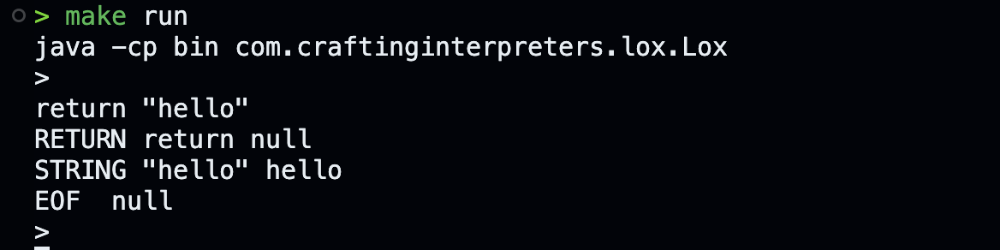
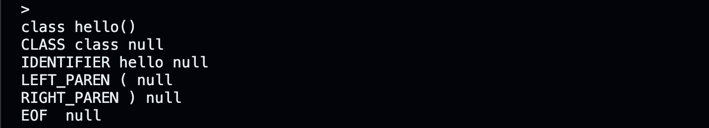

# Intrepreter for the Lox language in Java

## synopsis

This will be an implementation of the walking tree interepreter for a language called lox. More information about it can be found in the [crafting intrepreters book](https://craftinginterpreters.com/contents.html)

## steps to build and run

First navigate to com/
```shell
cd com
```

To just compile
```shell
make compile
```

To compile and run
```shell
make run
```

## REPL mode

Here are some examples of the lexer in REPL (Read-Eval-Print-Loop)



